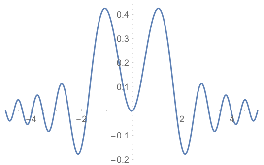

# 模拟退火算法(Simulated Annealing )
## 简介
模拟退火算法是基于Monte-Carlo 迭代求解策略的一种随机寻优算法


## 流程
给定目标函数$f(x): D \to R$，我们需要求出其在区域$D$上的最小值。假设初值为$x_0$,在$x_0$邻域内取一点$x_1$, 若$f(x_1)\leq f(x_0) $ 则认为$x_1$ 为更优的解，否则，以概率
$e^{-\frac{f(x_1)-f(x_0)}{T}}$ 认为该值为更优解，重复上述操作k次，到达次数后，降低温度T，例如$T=0.95*T$. 当T小于某个设定值时，迭代结束，输出最优解和函数值


## python代码实现
目标函数为 $f(x)=x^2$
```py
import numpy as np
import math
import random
import time
# tempature
T = 1.0
T_min = 1e-6
alpha = 0.95
# iteratir count
K_max = 200
# init value of solution
x_k = 2.0
x_best = x_k
# targert function
def f(x):
    return np.power(x,2)

start_tm = time.time()
iter_cnt = 0
# cooling loop
while T > T_min:
    k = 0
    # state loop
    while k < K_max:
        y = x_k + np.random.uniform(-0.2,0.2)
        delta = f(y) - f(x_k)
        if delta <= 0.0:
            x_best = y
        else:
            p = math.exp(-delta / T)
            if random.random() <= p:
                pass
            else:
                # not change
                y = x_k
        x_k = y
        k = k + 1
        iter_cnt = iter_cnt + 1
    # cooling
    T = alpha * T
end_tm = time.time()
print("解:{} 最小值:{:.2f}\n误差:{:.3f}".format(x_best,f(x_best), abs(x_best)))
print("迭代次数:{},用时:{:.2f}s".format(iter_cnt, end_tm - start_tm))
```


## 总结
1. 生成随机的解时，如果解不在定义域内，需要重新生成
2. 温度阈值越小，最后的精度越高，但计算量增加
3. 状态迭代次数越多，越可能找到全局最优解，但计算量增加
4. 对于某些函数，当极值点的集和较大,且初值与最优值较远时，容易不收敛，例如函数$f(x,y)=\frac{\sin(x^2+y^2)}{1+x^2+y^2}$



5. 双极小值的多项式函数$f(x)=\frac{1}{4}x^4-2x^2+x+3$，效果较好

```bash
解:-2.1148227518014893 最小值:-3.06
误差:0.000087
迭代次数:339000,用时:4.77s
```